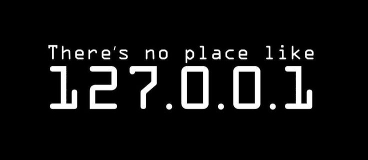

# ¡Hola! Soy Cristian Camilo Alzate Ramirez 👋

### Ingeniero independiente fullstack en desarrollo web.



Soy **Tecnólogo en Análisis y Desarrollo de Sistemas de Información** y en poco tiempo, seré **Ingeniero de Sistemas**.

Mi proyecto **[criscamideas](https://cristiancamiloalzateramirezweb.co)** refleja mi sueño de crecer como profesional en el mundo del desarrollo de software. Desde entonces, me he especializado en el desarrollo de sitios y aplicaciones web. Me apasiona fusionar la tecnología, la programación y el internet para ofrecer soluciones digitales que puedan beneficiar a la sociedad.

---

### 🌐 Mis Enlaces y Redes Sociales

🔗 **[Mi Portafolio](https://cristiancamiloalzateramirezweb.co/portafolio)** | **[Blog](https://cristiancamiloalzateramirezweb.co/blog)** | **[Podcast](https://open.spotify.com/show/3xHFVNTx4ihEvGvqerclhM)** | **[Tutoriales en YouTube](https://www.youtube.com/@cristiancamiloalzateramirezweb)**

💬 ¡Me encantaría conocerte! Estoy disponible para ayudarte con tus proyectos e ideas. Puedes contactarme a través del siguiente [formulario](https://www.cristiancamiloalzateramirezweb.co/contactame) o enviarme un correo a [ccalzateramirez@gmail.com](mailto:ccalzateramirez@gmail.com), y te responderé lo antes posible.

---

### 🚀 Conéctate conmigo en redes sociales:

<a href="https://www.facebook.com/criscamideas/" target="_blank"></a>  
<a href="https://www.instagram.com/criscamideas/" target="_blank"></a>  
<a href="https://twitter.com/criscamideas/" target="_blank"></a>  
<a href="https://www.youtube.com/@criscamideas/" target="_blank"></a>  
<a href="https://github.com/criscamideas/" target="_blank"></a>  
<a href="https://www.tiktok.com/@criscamideas/" target="_blank"></a>  
<a href="https://www.linkedin.com/in/cristiancamiloalzateramirez/" target="_blank"></a>

---

### 🛠️ Lenguajes y Herramientas

Aquí algunas de las herramientas que manejo:

- **Lenguajes**:  
  <code></code>  
  <code></code>  
  <code></code>  
  <code></code>  
  <code></code>  

- **Frameworks y Librerías**:  
  <code></code>  
  <code></code>  
  <code></code>

- **Backend y Bases de Datos**:  
  <code></code>  
  <code></code>  
  <code></code>  
  <code></code>  

- **Otras Herramientas**:  
  <code></code>  
  <code></code>  
  <code></code>  
  <code></code>  
  <code></code>

---

### 📄 Descargar mi Hoja de Vida

Puedes descargar mi hoja de vida en formato PDF haciendo clic [aquí](./assets/documents/hoja-vida.pdf).

---

### 📊 Esta semana dediqué mi tiempo a:

<!--START_SECTION:waka-->

```txt
React       3 hrs 00 mins    ▓▓▓▓▓▓▓▓▓▓░░░░░░░░░░   37.0 %
HTML        2 hrs 30 mins    ▓▓▓▓▓▓░░░░░░░░░░░░░░   30.5 %
CSS         2 hrs 30 mins    ▓▓▓▓▓▓░░░░░░░░░░░░░░   30.5 %
GitHub      50 mins          ▓░░░░░░░░░░░░░░░░░░░    2.0 %

<!--END_SECTION:waka-->
